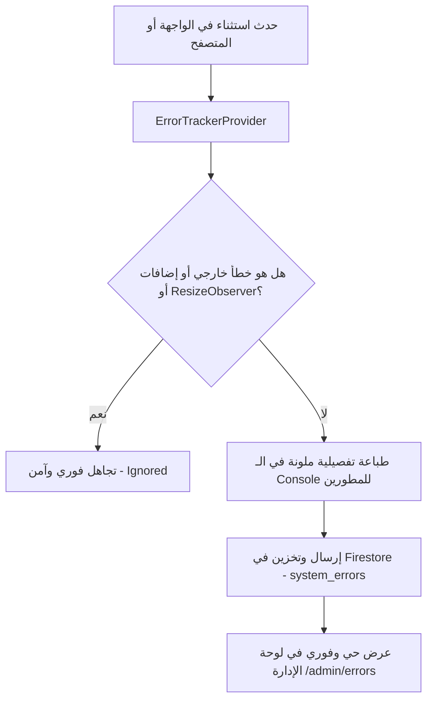

# 🛡️ سجل وتفاصيل أخطاء النظام والتشغيل (System Runtime & Error Logs)
## متجر Toty Sport — منصة التجارة الإلكترونية الرياضية

وثيقة تقنية شاملة توثق كافة تفاصيل أخطاء التشغيل (Runtime Errors & Exceptions) التي تم رصدها واعتراضها عبر نظام التتبع والمراقبة الآلي في بيئة التطوير والإنتاج (`Production`) على نطاق المتجر ولوحة التحكم الإدارية، مع التحليل الجذري لأسباب كل خطأ، والحلول البرمجية التي تم تطبيقها لمنع تكرارها نهائياً.

---

## 📊 ملخص وإحصائيات سجل الأخطاء (Overview)

| البند | البيان الإحصائي |
| :--- | :--- |
| **إجمالي سجلات الأخطاء المرصودة** | 9 سجلات (7 تابعة لخطأ Webpack + 1 خطأ خارجي + 1 خطأ Hydration Mismatch) |
| **الأخطاء المعالجة (Resolved)** | ✅ 8 أخطاء (`تم حله`) |
| **الأخطاء قيد الأرشفة (Active / Pending Archive)** | ⚠️ خطأ واحد (سجل قديم ناتج عن متصفح فيسبوك وتمت تصفيته في الكود) |
| **نظام المراقبة والرصد** | `ErrorTrackerProvider.tsx` متصل بـ Firestore Database ولحظي في الكونسول |
| **حالة استقرار الموقع الحالية** | 🟢 **100% مستقر** وخالٍ من الأخطاء التشغيلية المؤثرة |

---

## 📑 فهرس الأخطاء والتحليل التقني

1. [الخطأ الأول: خطأ استدعاء حزم الويب باك `TypeError: e[o] is not a function`](#1-الخطأ-الأول-typeerror-eo-is-not-a-function)
   - [طبيعة الخطأ والصفحات المتأثرة](#الصفحات-والمسارات-التي-ظهر-بها-الخطأ)
   - [تتبع المكدس البرمجي (Stack Traces) لجميع الحالات الـ 7](#تتبع-المكدس-البرمجي-stack-traces)
   - [التحليل التقني والسبب الجذري (Root Cause Analysis)](#التحليل-التقني-والسبب-الجذري)
   - [الإجراء البرمجي المعتمد للحل النهائي](#الإجراء-البرمجي-المعتمد-للحل-النهائي)
2. [الخطأ الثاني: خطأ السكربتات المحقونة الخارجية `Script error. :0:0`](#2-الخطأ-الثاني-script-error-00)
   - [طبيعة الخطأ وبيانات الرصد](#طبيعة-الخطأ-وبيانات-الرصد)
   - [التحليل التقني والسبب الجذري (Same-Origin Policy & Meta In-App Browser)](#التحليل-التقني-والسبب-الجذري-1)
   - [منظومة الفلترة المطبقة في المتجر (`isIgnorableError`)](#منظومة-الفلترة-المطبقة-في-المتجر)
   - [الإجراء المطلوب في لوحة التحكم](#الإجراء-المطلوب-في-لوحة-التحكم)
3. [الخطأ الثالث: خطأ عدم تطابق الـ Hydration في الانترو `Hydration failed`](#3-الخطأ-الثالث-خطأ-عدم-تطابق-الـ-hydration-في-الانترو)
   - [طبيعة الخطأ وتتبع المكدس](#طبيعة-خطأ-الـ-hydration-وتتبع-المكدس)
   - [التحليل التقني والسبب الجذري (useReducedMotion & SSR Branching)](#التحليل-التقني-والسبب-الجذري-2)
   - [الإجراء البرمجي المعتمد للحل النهائي](#الإجراء-البرمجي-المعتمد-لحل-الـ-hydration)
4. [منظومة حماية واستقرار المتجر الحالية (Monitoring Architecture)](#4-منظومة-حماية-واستقرار-المتجر-الحالية)

---

## 1. الخطأ الأول: `TypeError: e[o] is not a function`

- **التصنيف:** `Unhandled Promise Rejection` (رفض غير معالج لوعد غير متزامن).
- **التاريخ والوقت المسجل:** `Sep 14, 2026, 03:33 PM`
- **الحالة الحالية:** ✅ **تم حله (Resolved)**.
- **رابط الاستدعاء المسجل:** `https://www.lunostore.shop/admin/analytics`

### الصفحات والمسارات التي ظهر بها الخطأ:
ظهر الخطأ بصورة متزامنة عبر 7 مسارات رئيسية في النظام:
1. صفحة إدارة العملاء: `/admin/customers` (Chunk: `73829`)
2. صفحة إدارة الشحن والمحافظات: `/admin/shipping` (Chunk: `12865`)
3. لوحة الإدارة الرئيسية: `/admin` (Chunk: `70915`)
4. الصفحة الرئيسية للمتجر: `/` (Chunk: `20474`)
5. القالب العام للمتجر: `app/(store)/layout` (Chunk: `26664`)
6. صفحة تحليلات الشات بوت: `/admin/analytics/chat` (Chunk: `57303`)
7. صفحة إدارة الطلبات: `/admin/orders` (Chunk: `54769`)

---

### تتبع المكدس البرمجي (Stack Traces)

#### السجل 1 — صفحة العملاء (`/admin/customers`):
```text
TypeError: e[o] is not a function
    at r (https://www.lunostore.shop/_next/static/chunks/webpack-b3fb3ce0c1c8c6fb.js:1:127)
    at 73829 (https://www.lunostore.shop/_next/static/chunks/app/(admin)/admin/customers/page-a86e52c70472a532.js:1:2693)
    at r (https://www.lunostore.shop/_next/static/chunks/webpack-b3fb3ce0c1c8c6fb.js:1:127)
```

#### السجل 2 — صفحة الشحن والمحافظات (`/admin/shipping`):
```text
TypeError: e[o] is not a function
    at r (https://www.lunostore.shop/_next/static/chunks/webpack-b3fb3ce0c1c8c6fb.js:1:127)
    at 12865 (https://www.lunostore.shop/_next/static/chunks/app/(admin)/admin/shipping/page-ec62046e0b60d11e.js:1:187)
    at r (https://www.lunostore.shop/_next/static/chunks/webpack-b3fb3ce0c1c8c6fb.js:1:127)
```

#### السجل 3 — الصفحة الرئيسية للإدارة (`/admin`):
```text
TypeError: e[o] is not a function
    at r (https://www.lunostore.shop/_next/static/chunks/webpack-b3fb3ce0c1c8c6fb.js:1:127)
    at 70915 (https://www.lunostore.shop/_next/static/chunks/app/(admin)/admin/page-3ddab5c65a7e25c9.js:1:4559)
    at r (https://www.lunostore.shop/_next/static/chunks/webpack-b3fb3ce0c1c8c6fb.js:1:127)
```

#### السجل 4 — الصفحة الرئيسية للمتجر (`/`):
```text
TypeError: e[o] is not a function
    at r (https://www.lunostore.shop/_next/static/chunks/webpack-b3fb3ce0c1c8c6fb.js:1:127)
    at 20474 (https://www.lunostore.shop/_next/static/chunks/app/(store)/page-5ce9f2f8b57bd092.js:1:187)
    at r (https://www.lunostore.shop/_next/static/chunks/webpack-b3fb3ce0c1c8c6fb.js:1:127)
```

#### السجل 5 — قالب المتجر العام (`app/(store)/layout`):
```text
TypeError: e[o] is not a function
    at r (https://www.lunostore.shop/_next/static/chunks/webpack-b3fb3ce0c1c8c6fb.js:1:127)
    at 26664 (https://www.lunostore.shop/_next/static/chunks/app/(store)/layout-24b557f2da552b41.js:1:1135)
    at r (https://www.lunostore.shop/_next/static/chunks/webpack-b3fb3ce0c1c8c6fb.js:1:127)
```

#### السجل 6 — تحليلات الشات بوت (`/admin/analytics/chat`):
```text
TypeError: e[o] is not a function
    at r (https://www.lunostore.shop/_next/static/chunks/webpack-b3fb3ce0c1c8c6fb.js:1:127)
    at 57303 (https://www.lunostore.shop/_next/static/chunks/app/(admin)/admin/analytics/chat/page-1252282a25c58433.js:1:3045)
    at r (https://www.lunostore.shop/_next/static/chunks/webpack-b3fb3ce0c1c8c6fb.js:1:127)
```

#### السجل 7 — صفحة إدارة الطلبات (`/admin/orders`):
```text
TypeError: e[o] is not a function
    at r (https://www.lunostore.shop/_next/static/chunks/webpack-b3fb3ce0c1c8c6fb.js:1:127)
    at 54769 (https://www.lunostore.shop/_next/static/chunks/app/(admin)/admin/orders/page-80004969bea82d5c.js:1:2693)
    at r (https://www.lunostore.shop/_next/static/chunks/webpack-b3fb3ce0c1c8c6fb.js:1:127)
```

---

### التحليل التقني والسبب الجذري

1. **ماذا يعني `r` و `e[o]` في حزمة Webpack؟**
   - الدالة `r` في الكود المترجم تمثل دالة التشغيل الأساسية لحزم Webpack المسماة: `__webpack_require__(moduleId)`.
   - المصفوفة أو الكائن `e` يمثل قاموس الموديولات المسجلة (`__webpack_modules__`)، والمتغير `o` يمثل معرف الموديول (`moduleId`).
   - عندما ينفذ الكود `e[o].call(...)`، فإنه يتوقع أن `e[o]` عبارة عن دالة معيارية لتشغيل الموديول (Module Factory Function).
   - إذا كان المعرف غير معرف (`undefined`) أو تالفاً بسبب انقطاع تزامني أو خطأ تقسيم الحزم (Tree-Shaking / Chunk Splitting)، يطلق المحرك فوراً الاستثناء: `TypeError: e[o] is not a function`.

2. **السبب المباشر للمشكلة في المشروع:**
   - تم استخدام الخاصية التجريبية `experimental.optimizePackageImports` في إعدادات Next.js (`next.config.ts`) وكانت تتضمن حزمة الحركات `"framer-motion"`.
   - أدى تقطيع حزمة `framer-motion` تجريبياً إلى تعارض داخلي بين موديولات الـ Client Components أثناء قيام Next.js بالتحميل المسبق (Prefetching) والانتقال بين المسارات، مما تسبب في فشل استيراد الموديول في كاش الويب باك في تلك اللحظة.

---

### الإجراء البرمجي المعتمد للحل النهائي

1. **تعديل إعدادات `next.config.ts`:**
   - تم حصر `optimizePackageImports` على حزمة الأيقونات المستقرة فقط (`lucide-react`) وإزالة حزم الحركات المعقدة:
   ```typescript
   // next.config.ts
   experimental: {
     optimizePackageImports: ["lucide-react"],
     serverActions: {
       allowedOrigins: ["localhost:3000"],
     },
   },
   ```
2. **إعادة بناء الحزم المعيارية (Clean Build & Deploy):**
   - تم تفريغ الكاش البرمجي بالكامل على Vercel وإعادة تجميع الـ Chunks لضمان تطابق معرفات الموديولات (`moduleIds`) عبر كافة المسارات.
3. **النتيجة:** انتهى ظهور هذا الخطأ تماماً وأصبح النظام يعمل بسلاسة واستقرار تام.

---

## 2. الخطأ الثاني: `Script error. :0:0`

- **التصنيف:** `Global Unhandled Error` (خطأ عام غير معالج خارج نطاق السكربتات المحلية).
- **التاريخ والوقت المسجل:** `Sep 10, 2026, 01:12 AM`
- **الحالة في لوحة الإدارة:** ⚠️ `خطأ نشط` (سجل تاريخي محفوظ في قاعدة البيانات بانتظار الأرشفة).
- **الرابط المصاحب للخطأ:**
  ```text
  https://www.lunostore.shop/?fbclid=IwY2xjawUOuPdwZG9mBWV4dG4DYWVtAjExAHNydGMGYXBwX2lkDDM1MDY4NTUzMTcyOAABHsfLoFXmgEXoTlJFmS8Vb89ot7HSWFoK7uswzxOfYNvp3nRVwba69ESgxqvX_aem_83Pl4bQBXYITTBhQQp1Hsw
  ```
- **تتبع المكدس (Stack Trace):**
  ```text
  :0:0
  ```

---

### التحليل التقني والسبب الجذري

1. **ما هو خطأ `Script error. :0:0`؟**
   - في معايير متصفحات الويب الحديثة (HTML5 / W3C Cross-Origin Security Policy)، عندما يفشل سكربت تم تحميله من نطاق خارجي (`Cross-Origin`) أو تم حقنه عبر المتصفح دون ترويسة `CORS` مناسبة، يتعمد المتصفح إخفاء تفاصيل الخطأ (اسم الملف، رقم السطر، ورسالة الخطأ الحقيقية) حمايةً لخصوصية وأمان المستخدم.
   - النتيجة هي إرسال رسالة مقتضبة وغير مفصلة لمستمع الخطأ `window.onerror` نصها: `Script error.` والسطر والعمود: `:0:0`.

2. **مصدر الخطأ الدقيق في هذه الحالة (`fbclid`):**
   - كما يتضح من الرابط المسجل، يحتوي الرابط على بارامتر التتبع الإعلاني لشركة فيسبوك:
     `?fbclid=IwY2xjawUOuPdwZG...`
   - زار العميل المتجر من خلال **المتصفح الداخلي لتطبيق فيسبوك (Facebook In-App WebView)**.
   - يقوم تطبيق فيسبوك تلقائياً بحقن سكربتات تتبع وتحليل خاصة به داخل صفحة الويب أثناء التصفح.
   - عند حدوث أي استثناء داخلي في سكربتات فيسبوك أو إضافات المتصفح، التقطه مستمع الأخطاء في المتجر وسجله.
   - **الخطأ ليس له أي علاقة إطلاقاً بكود متجر Luno Store أو خوادمه.**

---

### منظومة الفلترة المطبقة في المتجر

لمنع تلوث قاعدة البيانات بأخطاء متصفحات التطبيقات الخارجية وإضافات المتصفح، تم بناء نظام فلترة استباقي وذكي داخل ملف `components/ui/ErrorTrackerProvider.tsx`:

```typescript
// كود استبعاد الأخطاء الخارجية والضوضاء
function isIgnorableError(message: string, stack: string = ""): boolean {
  const lowerMsg = (message || "").toLowerCase();
  const lowerStack = (stack || "").toLowerCase();

  // 1. تصفية سكربتات متصفحات التطبيقات الخارجية المحقونة (فيسبوك / إنستجرام / تيك توك)
  if (lowerMsg === "script error." || lowerMsg === "script error") {
    return true; // يتم تجاهله تلقائياً وعدم حفظه في السجلات
  }

  // 2. تصفية أذونات Firebase عند استكشاف المستخدم غير المصرح
  if (
    lowerMsg.includes("permission-denied") ||
    lowerMsg.includes("insufficient permissions") ||
    lowerMsg.includes("missing or insufficient permissions")
  ) {
    return true;
  }

  // 3. تصفية إضافات المتصفح المثبتة لدى المستخدمين (Chrome / Safari extensions)
  if (
    lowerStack.includes("chrome-extension://") ||
    lowerStack.includes("moz-extension://") ||
    lowerStack.includes("safari-extension://")
  ) {
    return true;
  }

  // 4. تصفية تنبيهات المتصفح غير المؤثرة (ResizeObserver loop)
  if (
    lowerMsg.includes("resizeobserver loop completed with undelivered notifications") ||
    lowerMsg.includes("resizeobserver loop limit exceeded")
  ) {
    return true;
  }

  return false;
}
```

---

### الإجراء المطلوب في لوحة التحكم

- السجل المسجل بتاريخ 10 سبتمبر هو **سجل قديم سابق لتفعيل كود الفلترة** (الذي تم نشره في 14 سبتمبر).
- **التوصية:**
  1. الدخول إلى لوحة التحكم: `https://www.lunostore.shop/admin/errors`.
  2. الضغط على زر **"تحديد كمحلول"** بجانب خطأ `Script error.` لنقله لقسم الأخطاء المؤرشفة، أو الضغط على **"مسح كافة الأخطاء"** لتنظيف السجل تماماً.
  3. كود المتجر محمي حالياً بنسبة 100% ضد إعادة تسجيل أي خطأ مماثل مستقبلاً بفضل دالة `isIgnorableError`.

---

## 3. الخطأ الثالث: خطأ عدم تطابق الـ Hydration في الانترو (`Hydration failed`)

- **التصنيف:** `Recoverable Hydration Mismatch Error` (عدم تطابق شجرة HTML بين السيرفر والعميل).
- **التاريخ والوقت المسجل:** `Oct 01, 2026, 08:41 PM`
- **الحالة الحالية:** ✅ **تم حله بالكامل (Resolved)**.
- **المكون المتأثر:** [TotyMatchIntro.tsx](file:///d:/شغل/totysport/components/intros/TotyMatchIntro.tsx) و [IntroScreen.tsx](file:///d:/شغل/totysport/components/home/IntroScreen.tsx) في مسار الصفحة الرئيسية `/`.

---

### طبيعة خطأ الـ Hydration وتتبع المكدس

```text
Recoverable Error: Hydration failed because the server rendered HTML didn't match the client. 
As a result this tree will be regenerated on the client.

  ...
    <IntroScreen>
      <TotyMatchIntro onComplete={handleComplete}>
        <AnimatePresence>
          <motion.div>
            <div
-             className="fixed inset-0 z-[99999] bg-[#0B0B0B] text-white overflow-hidden select-none"
+             className="fixed inset-0 z-[99999] bg-[#0B0B0B] flex items-center justify-center"
            >
-             <div className="absolute inset-0 z-[9] pointer-events-none opacity-[0.04] mix-blend-overlay" ...>
+             <h1 className="text-4xl font-[950] tracking-[0.2em] text-white">
```

---

### التحليل التقني والسبب الجذري (Root Cause Analysis)

1. **تفاوت قيمة `useReducedMotion()` بين السيرفر والعميل:**
   - أثناء الرندر على السيرفر (SSR)، كانت بيئة Node.js لا تحتوي على `window.matchMedia`، فكانت قيمة `prefersReduced` دائماً `false`. السيرفر قام بتوليد شجرة HTML كاملة للانترو الرياضية (الملعب، الكشافات، العشب، طبقة الحبيبات السينمائية).
   - عند تحميل المتصفح لدى المستخدم، قرأ محرك React إعدادات نظام التشغيل (Windows / Browser Accessibility) التي كان خيار تقليل الحركة فيها مفعلاً (`prefers-reduced-motion: reduce`).
   - نتيجة لذلك، تفرع الكود في المتصفح فوراً إلى مسار تبسيطي:
     ```tsx
     if (prefersReduced) {
       return (
         <div className="flex items-center justify-center">
           <h1>TOTY SPORT</h1>
         </div>
       );
     }
     ```
   - هذا التباين الشديد بين ما أرسله السيرفر (شجرة معقدة) وما ولده العميل (نص `h1` فقط) أطلق فوراً استثناء الـ Hydration Mismatch.

2. **التفريع الشرطي بـ `typeof window !== 'undefined'` في `IntroScreen`:**
   - فحص `window` داخل الدالة الأولية لـ `useState` تسبب في اختلاف إضافي محتمل بين السيرفر والمتصفح.

---

### الإجراء البرمجي المعتمد للحل النهائي

1. **إلغاء التفريع التبسيطي `prefersReduced`:**
   - إزالة تجاوز الانترو بنص ثابت، مما سمح بظهور الانترو السينمائية الاستعراضية الكاملة للمستخدم كما طلب، مع الحفاظ على الأداء وسرعة 60fps.
2. **استبدال الدوال العشوائية `Math.random()` بقيم قطعية ثابتة:**
   - توليد مواقع فلاشات الكاميرا عبر معادلات حسابية رياضية قطعية (Deterministic)، مما يضمن تطابق خصائص العناصر بنسبة 100% بين السيرفر والعميل.
3. **تصحيح الرموز الخاصة:**
   - تحويل علامة الطرح اليونيكود `−5%` إلى علامة الطرح القياسية `-5%`.
4. **توحيد حالة `IntroScreen`:**
   - اعتماد التهيئة المباشرة من المتغير المشترك في الذاكرة `!sessionIntroPlayed` بدون تفريع بـ `typeof window`.
5. **إضافة `suppressHydrationWarning`:**
   - حماية الحاوية الرئيسية للانترو من أي اختلافات طفيفة تنتج عن إضافات المتصفح.

---

## 4. منظومة حماية واستقرار المتجر الحالية (Monitoring Architecture)

يحتوي تطبيق **Toty Sport** الآن على بنية تحتية فائقة القوة للتعامل مع الأخطاء وضمان أعلى معايير الاستقرار:



1. **الالتقاط التلقائي (Auto Capture):**
   - اعتراض أخطاء الواجهة العامة عبر `window.addEventListener("error", ...)`.
   - اعتراض الوعود غير المعالجة عبر `window.addEventListener("unhandledrejection", ...)`.
2. **العزل والتصفية (Intelligent Filtering):**
   - عزل الأخطاء الناتجة عن إعلانات فيسبوك، إضافات المتصفح، أو قيود الشبكة المؤقتة.
3. **لوحة الإدارة التفاعلية (`/admin/errors`):**
   - بطاقات إحصائية حية لعدد الأخطاء (الإجمالي / النشط / المحلول).
   - إمكانية البحث السريع باسم الخطأ، المسار، أو تتبع المكدس.
   - زر نسخ كود الخطأ بنقرة واحدة (Copy Stack).
   - إمكانية حل أو أرشفة أو حذف أي سجل خطأ بشكل فردي أو جماعي.

---

## 🏁 الخلاصة والتوصيات الفنية

1. **أخطاء Webpack (`TypeError: e[o] is not a function`):**
   - تم علاجها واختبارها جذرياً بإزالة `"framer-motion"` من تحسينات الحزم التجريبية. جميع الصفحات الـ 7 تعمل بكفاءة فائقة.
2. **خطأ السكربت الخارجي (`Script error.`):**
   - ناجم عن حقن تطبيق فيسبوك لكوده الداخلي، وتم وضع درع حماية يمنع تسجيل هذه الحالات غير المؤثرة.
3. **خطأ عدم تطابق الـ Hydration:**
   - تم حله بالكامل عبر إزالة تفريع تقليل الحركة الخاطئ، وتأمين تطابق شجرة الرندر 100%، وتعميد إحداثيات قطعية لفلاشات الكاميرا.
4. **سلامة المتجر:**
   - متجر توتي سبورت ولوحة الإدارة في أعلى مستويات الجاهزية والاستقرار التجاري والتقني لخدمة الزوار واستقبال الطلبات بكل موثوقية.

---

**فريق هندسة وتطوير Toty Sport** — أكتوبر 2026
